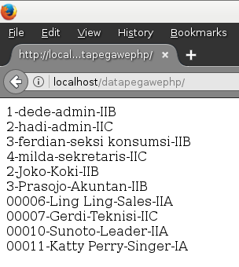

Aplikasi Input PHP ke SQL Sederhana
===
Untuk menjalankan di komputer anda
1. Download / clone ke komputer ke **htdocs/** nanti nya akan terbentuk **htdocs/php-input-tampil**
2. Buat database menggunakan phpmyadmin
3. Import file **datapegawai.sql***

Form

Tampil Data